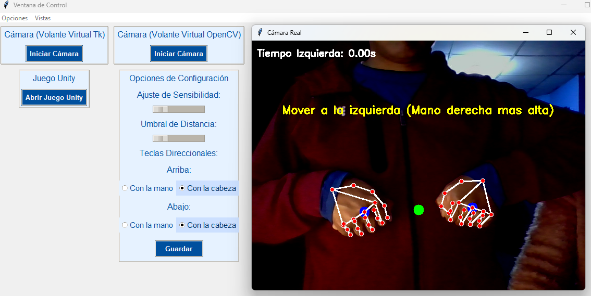
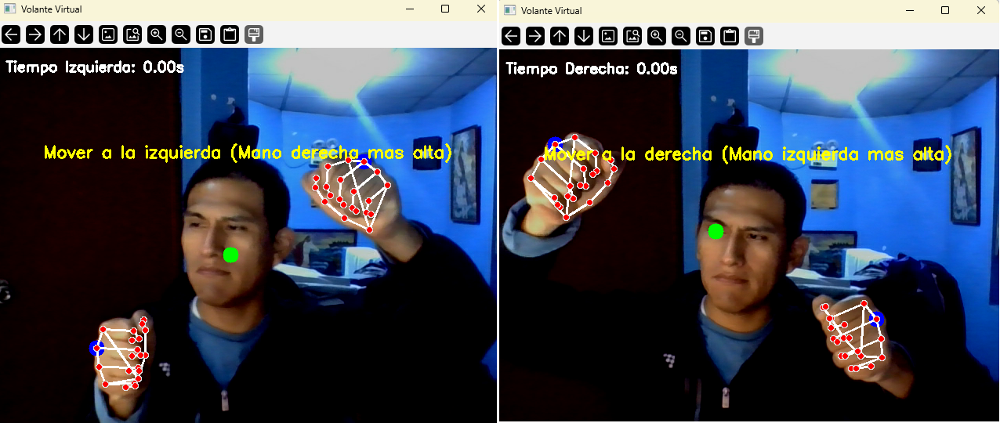

# Interfaz de Control para Videojuegos Multiusuario con Gestos de Mano o Cabeza en Juegos Basados en Teclas Direccionales

## Introduction
Este proyecto presenta un sistema de reconocimiento de gestos de mano en tiempo real capaz de controlar un juego en 3D a través de gestos intuitivos de la mano. El sistema aprovecha técnicas de visión por computadora, aprendizaje automático y gráficos 3D para proporcionar una experiencia de usuario natural e inmersiva.


## Características Clave
- **Detección de Puntos de Referencia de la Mano:** El sistema utiliza la biblioteca MediaPipe para detectar manos en una transmisión de video y extraer 21 puntos de referencia para cada mano.
- **Control de Juegos en 3D:** Los gestos de la mano reconocidos se traducen en manipulaciones correspondientes en el juego 3D, como mover el personaje o interactuar con el entorno.

## Tecnologías y Plataformas
La implementación del sistema utiliza las siguientes tecnologías y plataformas:
- OpenCV: Para el procesamiento de video y manipulación de imágenes.
- MediaPipe: Para la detección de manos y extracción de puntos de referencia.
- Python: El lenguaje de programación principal utilizado para la implementación.
- Unity: Para el desarrollo y control del juego en 3D.

## Dataset
El proyecto utiliza un dataset disponible públicamente del repositorio de GitHub KNN Alphabet. Este dataset contiene coordenadas de puntos de referencia de la mano etiquetadas para cada letra del alfabeto de la lengua de señas americana (ASL), con un total de 24,000 puntos de datos.


## Demo
Aquí tienes una demostración del sistema de reconocimiento de gestos de mano en tiempo real en acción:




## Detalles de Implementación
La implementación del sistema de reconocimiento de gestos de mano en tiempo real para el control de juegos en 3D implica los siguientes pasos clave:
1. Inicializar el objeto de manos de MediaPipe para la detección de manos y extracción de puntos de referencia.
2. Cargar el modelo de aprendizaje automático entrenado para el reconocimiento de gestos.
3. Crear un objeto normalizador para estandarizar las coordenadas de los puntos de referencia.
4. Procesar cada fotograma de la transmisión de video, detectar manos y extraer las coordenadas de los puntos de referencia.
5. Alimentar los puntos de referencia normalizados en el modelo entrenado para predecir el gesto correspondiente.
6. Realizar la manipulación adecuada en el juego 3D basada en el gesto predicho.
7. Visualizar los puntos de referencia de la mano detectados en el fotograma de video.
8. Mostrar el fotograma procesado y manejar la entrada del usuario.

### 2. Instalación de Dependencias

#### Archivos Necesarios
Para ejecutar el proyecto, se requieren las bibliotecas listadas en `requirement.txt`.

#### Instalación para Distribuciones Basadas en Debian (Ubuntu, etc.)

1. **Actualizar paquetes:**
    ```bash
    sudo apt update
    ```

2. **Instalar Python y pip (si no están instalados):**
    ```bash
    sudo apt install python3 python3-pip -y
    ```

3. **Instalar librerías adicionales:**
    ```bash
    sudo apt install wine
    ```

4. **Instalar las dependencias del proyecto:**
    ```bash
    pip3 install -r requirement.txt
    ```

#### Instalación para Distribuciones Basadas en Arch (Manjaro, Arch Linux, etc.)

1. **Actualizar el sistema:**
    ```bash
    sudo pacman -Syu
    ```

2. **Instalar Python y pip:**
    ```bash
    sudo pacman -S python python-pip
    ```

3. **Instalar librerías adicionales:**
    ```bash
    sudo pacman -S wine
    ```

4. **Instalar las dependencias del proyecto:**
    ```bash
    pip install -r requirement.txt
    ```

#### Instalación en Windows

1. **Instalar Python:** Descarga e instala Python, asegurándote de marcar la casilla "Add Python to PATH" durante la instalación.

2. **Instalar las dependencias del proyecto:** Abre el Símbolo del sistema y ejecuta:
    ```bash
    pip install -r requirement.txt
    ```
### 3. Estructura de Archivos

- `camara_openCV.py`, `camara_tk.py`, `handDetection.py`, `main.py`, `model.py`: Scripts Python para diversas funciones del proyecto.
- `GameUnity/carrera.exe`: Ejecutable del juego Unity.
- `interface.py`: Archivo principal para iniciar el menú del proyecto.
- `requirement.txt`: Lista de dependencias necesarias.

### 4. Ejecución del Proyecto

#### Ejecutar el Menú Principal

Para iniciar el menú principal, ejecuta `interface.py`:
1. **Ejecutar el menú principal:**
    ```bash
    python3 interface.py
    ```

## Evaluación del Rendimiento
El sistema se evaluó en base a los siguientes métricos:
- **Respuesta en Tiempo Real:** El sistema demostró un rendimiento robusto en tiempo real al reconocer gestos de la mano y traducirlos en manipulaciones en el juego 3D.
- **Usabilidad:** El sistema proporcionó una interfaz intuitiva y natural para el control del juego en 3D, mejorando la experiencia del usuario.

## Desafíos y Soluciones
El proyecto enfrentó desafíos relacionados con las condiciones de iluminación y la orientación de la mano. Las soluciones potenciales incluyen explorar técnicas avanzadas de detección y seguimiento de manos.

## Mejoras Futuras
Las posibles mejoras futuras para este proyecto incluyen:
- Incorporar algoritmos más robustos de detección y seguimiento de manos para manejar condiciones de iluminación y orientaciones de manos variables.
- Integrar soporte para una gama más amplia de técnicas de manipulación de objetos en 3D, como escalado y traslación.
- Explorar la integración con entornos de realidad virtual y aumentada para una experiencia de usuario más inmersiva.

## Conclusiones
ESe diseñó e implementó un sistema de reconocimiento de gestos de manos basado en visión artificial y detección de patrones en tiempo real, logrando una alternativa innovadora al uso de teclas direccionales en videojuegos. Este enfoque mejora la inmersión del jugador y hace la experiencia de juego más accesible, especialmente para usuarios con discapacidades motoras. Los resultados demostraron una alta precisión y rapidez en la respuesta a los gestos 4, garantizando una interacción fluida e idónea. Además, se implementaron opciones de personalización en la interfaz, como sensibilidad, umbral de distancia y disposición de widgets, lo cual contribuye a su usabilidad y versatilidad.

Se desarrolló una arquitectura cliente-servidor eficiente que soporta múltiples usuarios simultáneos, garantizando una comunicación en tiempo real y ofreciendo flexibilidad para configuraciones individuales de red y selección de personajes dentro del juego 13. El diseño utiliza hilos de ejecución y recursos como la cámara de manera responsable, mejorando la estabilidad y minimizando conflictos durante el uso de la interfaz, lo que contribuye a un mayor rendimiento y sincronización.

El videojuego desarrollado en Unity fue adaptado para su ejecución en plataformas PC y dispositivos móviles, ampliando su alcance y permitiendo a los jugadores disfrutar de una experiencia consistente e inmersiva independientemente del dispositivo utilizado. La integración de controles tradicionales junto con la interfaz basada en gestos asegura una mayor inclusión de diferentes estilos de juego y preferencias del usuario.

En la evaluación comparativa del sistema de control por gestos frente a los métodos tradicionales, se evidenciaron ventajas en innovación y experiencia inmersiva. Aunque los controles tradicionales mantienen una ventaja en precisión y confiabilidad bajo condiciones técnicas menos óptimas, la interfaz de gestos demostró ser una solución intuitiva y accesible, capaz de mejorar la satisfacción del usuario al adaptarse a sus preferencias y necesidades.

## Logros Alcanzados

Se logró construir un sistema cliente-servidor robusto utilizando Node.js, capaz de soportar una cantidad configurable de jugadores. Cada cliente, desarrollado en Unity, incorpora un script denominado SocketManager que facilita la comunicación bidireccional con el servidor. Esto permite sincronizar el inicio del juego cuando todos los jugadores se han conectado y configurado.
En el cliente, se diseñó un panel de inicio que ofrece a cada jugador la posibilidad de configurar los parámetros de red, seleccionar personaje y esperar a que se alcance el número mínimo de participantes configurado en el servidor antes de iniciar la partida.
El videojuego desarrollado fue adaptado para ejecutarse tanto en PC como en dispositivos móviles, brindando una experiencia multiplataforma. Además, se incorporaron dos opciones de control para los jugadores que utilizan PC:
- Control Tradicional: Uso de teclas direccionales para moverse hacia la izquierda, derecha, avanzar o retroceder.
- Interfaz de Control por Gestos: Un sistema que utiliza la cámara del dispositivo para detectar gestos de manos y rostro, los cuales se mapean a las acciones de las teclas direccionales del juego.

