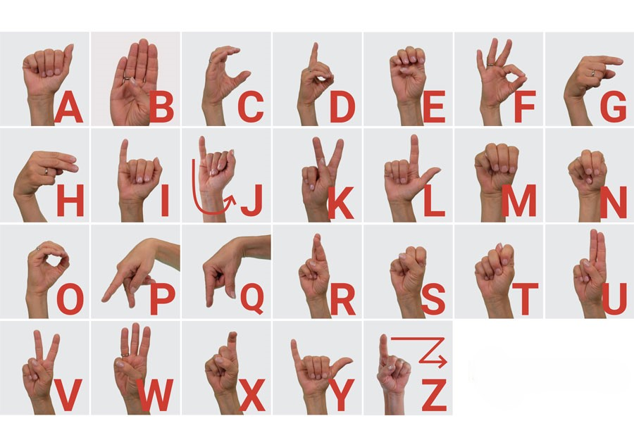

# Real-Time Hand Gesture Recognition for 3D Object Manipulation

## Introduction
Este proyecto presenta un sistema de reconocimiento de gestos de mano en tiempo real capaz de controlar un juego en 3D a través de gestos intuitivos de la mano. El sistema aprovecha técnicas de visión por computadora, aprendizaje automático y gráficos 3D para proporcionar una experiencia de usuario natural e inmersiva.

## Características Clave
- **Detección de Puntos de Referencia de la Mano:** El sistema utiliza la biblioteca MediaPipe para detectar manos en una transmisión de video y extraer 21 puntos de referencia para cada mano.
- **Control de Juegos en 3D:** Los gestos de la mano reconocidos se traducen en manipulaciones correspondientes en el juego 3D, como mover el personaje o interactuar con el entorno.

## Tecnologías y Plataformas
La implementación del sistema utiliza las siguientes tecnologías y plataformas:
- OpenCV: Para el procesamiento de video y manipulación de imágenes.
- MediaPipe: Para la detección de manos y extracción de puntos de referencia.
- Python: El lenguaje de programación principal utilizado para la implementación.
- Unity: Para el desarrollo y control del juego en 3D.

## Dataset
El proyecto utiliza un dataset disponible públicamente del repositorio de GitHub KNN Alphabet. Este dataset contiene coordenadas de puntos de referencia de la mano etiquetadas para cada letra del alfabeto de la lengua de señas americana (ASL), con un total de 24,000 puntos de datos.

 

## Demo
Aquí tienes una demostración del sistema de reconocimiento de gestos de mano en tiempo real en acción:

## Detalles de Implementación
La implementación del sistema de reconocimiento de gestos de mano en tiempo real para el control de juegos en 3D implica los siguientes pasos clave:
1. Inicializar el objeto de manos de MediaPipe para la detección de manos y extracción de puntos de referencia.
2. Cargar el modelo de aprendizaje automático entrenado para el reconocimiento de gestos.
3. Crear un objeto normalizador para estandarizar las coordenadas de los puntos de referencia.
4. Procesar cada fotograma de la transmisión de video, detectar manos y extraer las coordenadas de los puntos de referencia.
5. Alimentar los puntos de referencia normalizados en el modelo entrenado para predecir el gesto correspondiente.
6. Realizar la manipulación adecuada en el juego 3D basada en el gesto predicho.
7. Visualizar los puntos de referencia de la mano detectados en el fotograma de video.
8. Mostrar el fotograma procesado y manejar la entrada del usuario.

## Evaluación del Rendimiento
El sistema se evaluó en base a los siguientes métricos:
- **Respuesta en Tiempo Real:** El sistema demostró un rendimiento robusto en tiempo real al reconocer gestos de la mano y traducirlos en manipulaciones en el juego 3D.
- **Usabilidad:** El sistema proporcionó una interfaz intuitiva y natural para el control del juego en 3D, mejorando la experiencia del usuario.

## Desafíos y Soluciones
El proyecto enfrentó desafíos relacionados con las condiciones de iluminación y la orientación de la mano. Las soluciones potenciales incluyen explorar técnicas avanzadas de detección y seguimiento de manos.

## Mejoras Futuras
Las posibles mejoras futuras para este proyecto incluyen:
- Incorporar algoritmos más robustos de detección y seguimiento de manos para manejar condiciones de iluminación y orientaciones de manos variables.
- Integrar soporte para una gama más amplia de técnicas de manipulación de objetos en 3D, como escalado y traslación.
- Explorar la integración con entornos de realidad virtual y aumentada para una experiencia de usuario más inmersiva.

## Conclusión
El sistema de reconocimiento de gestos de mano en tiempo real para el control de juegos en 3D presentado en este proyecto ofrece una solución convincente para la interacción intuitiva y natural con contenido digital. Al aprovechar técnicas de visión por computadora, aprendizaje automático y gráficos 3D, el sistema proporciona una experiencia de usuario fluida y atractiva, allanando el camino para aplicaciones innovadoras en diversos dominios.
